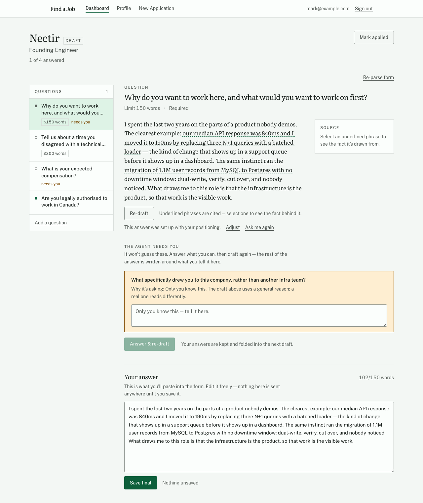
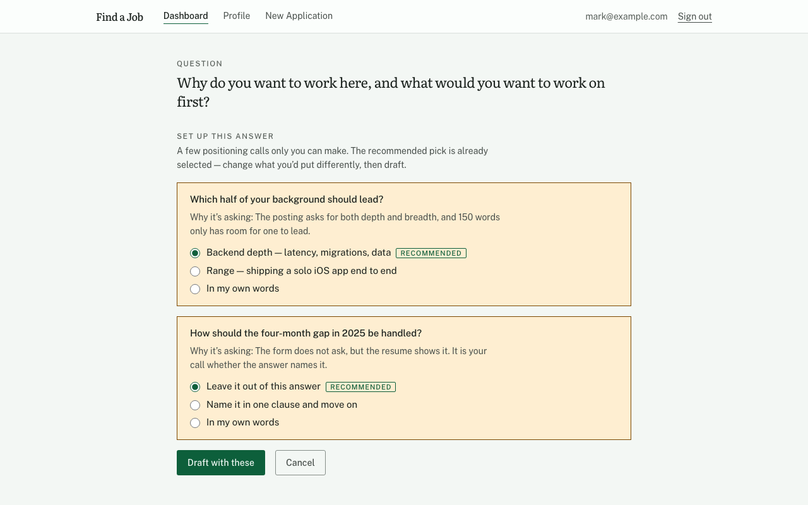
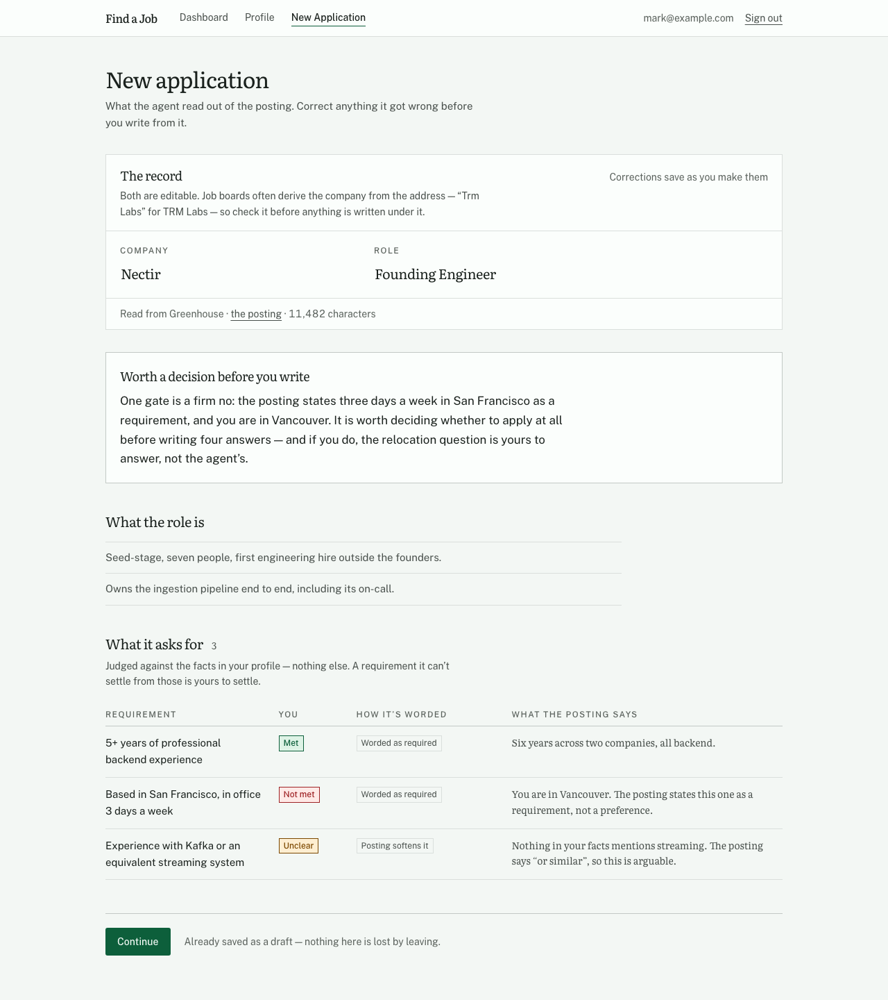
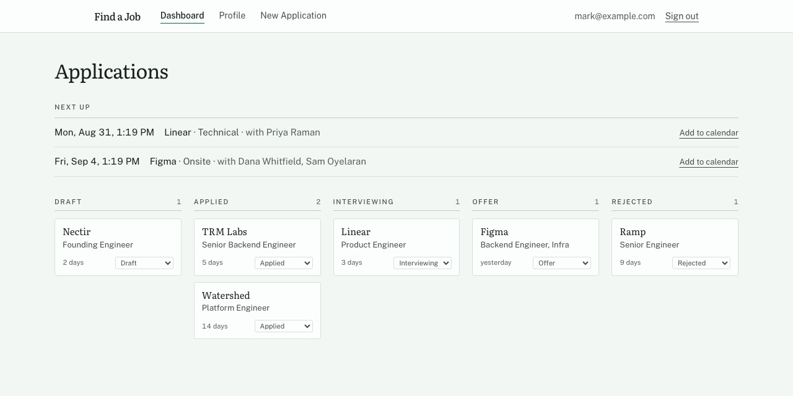
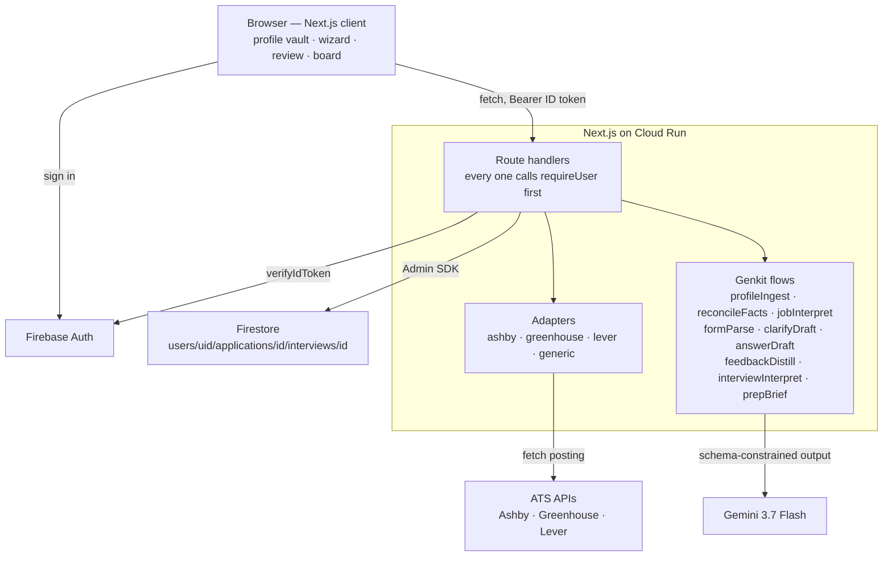

# Find a Job

**Your story is unique. AI helps you tell it — it doesn't replace it.**

An agent that fills in job applications the way a good friend would: it reads your resume once,
reads the posting, and then writes each answer out of things you have actually done — with every
claim underlined and traceable back to the fact it came from. Where a fact would have to be
invented it stops and asks you instead of guessing, and before it drafts anything long it puts
the positioning calls to you: which half of your background should lead, whether the gap in 2025
gets named. It reads the posting's hard requirements against your profile and says plainly when
one is a firm no, so you can decide whether to apply at all before writing four answers. And it
learns your voice from your edits — each time you rewrite one of its sentences, the rule you were
applying is distilled and kept.

**Live:** <https://find-a-job-572064776552.us-west1.run.app>

---

## What it looks like

| | |
|---|---|
|  |  |
| **Grounded drafting.** Underlined phrases are citations — select one and the fact behind it appears. What is not underlined is the agent's own prose, and looks like it. | **The clarify loop.** Before a long answer, the calls only you can make — each with a recommendation already picked, so the fast path is to glance and draft. |
|  |  |
| **Hard gates, judged honestly.** Every requirement gets a verdict against your facts, a read of how firmly it is worded, and — when one is unmet — an apply-or-skip advisory. | **The pipeline.** Where everything is, and what has gone quiet. Interviews still ahead sit above it and export to your calendar. |

The empty dashboard has a **Load sample data** button. It writes one invented candidate, one
invented posting and one booked interview into your own account, so the product can be seen full
without pasting a real resume first.

---

## Running it locally

About ninety seconds, most of it waiting on `npm install`.

```sh
git clone <repository-url> find-a-job && cd find-a-job
cp .env.example .env.local          # then fill in the five values below
npm install
gcloud auth application-default login
npm run dev                         # http://localhost:3000
```

`.env.local`:

| Variable | Where to get it |
|---|---|
| `GEMINI_API_KEY` | <https://aistudio.google.com/apikey> — the Gemini Developer API; the free tier is enough |
| `NEXT_PUBLIC_FB_API_KEY` | Firebase console → Project settings → Your apps → Web app → SDK setup |
| `NEXT_PUBLIC_FB_AUTH_DOMAIN` | same panel — `your-project.firebaseapp.com` |
| `NEXT_PUBLIC_FB_PROJECT_ID` | same panel |
| `NEXT_PUBLIC_FB_APP_ID` | same panel — `1:000000000000:web:…` |
| `REDDIT_CLIENT_ID` | *optional, for Reddit write-ups* — <https://www.reddit.com/prefs/apps>, "create app" → **installed app**. Reddit refuses its public JSON to servers, so without an id the research reads no Reddit at all |
| `REDDIT_CLIENT_SECRET` | *optional* — leave unset for an installed app, which has none |

Two things have to be switched on in the Firebase project itself: **Firestore** in Native mode,
and the **Email/password** and **Google** sign-in providers under Authentication. `localhost` is
an authorized domain by default, so nothing else is needed for local work.

No service-account key lives in this repo, and none should. `gcloud auth application-default
login` is what gives the server side its Firestore credentials locally; on Cloud Run the same
code picks up the runtime service account instead.

```sh
npm test          # 968 tests
npm run build     # production build, typecheck included
```

### Making yourself the administrator

The admin panel (`/admin`) is shown to the one account whose ID token carries the `admin`
claim. Set it once, from a machine with `gcloud auth application-default login` done:

```sh
npx tsx --env-file=.env.local scripts/grant-admin.ts you@example.com
```

Sign out and back in to pick the claim up now; otherwise it arrives within the hour.
`--revoke` takes it away again.

## Deploying

The service runs on Cloud Run from source — no Dockerfile; buildpacks handle it. The four
`NEXT_PUBLIC_*` values must be passed as *build* env vars as well as runtime ones (Next.js inlines
them into the client bundle at build time). One line:

```sh
set -a; . ./.env.local; set +a && gcloud run deploy find-a-job --source . --region us-west1 --allow-unauthenticated \
  --set-env-vars "^##^GEMINI_API_KEY=${GEMINI_API_KEY}##NEXT_PUBLIC_FB_API_KEY=${NEXT_PUBLIC_FB_API_KEY}##NEXT_PUBLIC_FB_AUTH_DOMAIN=${NEXT_PUBLIC_FB_AUTH_DOMAIN}##NEXT_PUBLIC_FB_PROJECT_ID=${NEXT_PUBLIC_FB_PROJECT_ID}##NEXT_PUBLIC_FB_APP_ID=${NEXT_PUBLIC_FB_APP_ID}" \
  --update-build-env-vars "^##^NEXT_PUBLIC_FB_API_KEY=${NEXT_PUBLIC_FB_API_KEY}##NEXT_PUBLIC_FB_AUTH_DOMAIN=${NEXT_PUBLIC_FB_AUTH_DOMAIN}##NEXT_PUBLIC_FB_PROJECT_ID=${NEXT_PUBLIC_FB_PROJECT_ID}##NEXT_PUBLIC_FB_APP_ID=${NEXT_PUBLIC_FB_APP_ID}"
```

`firestore.rules` denies every direct client read and write. That is correct rather than
restrictive: no browser in this product touches Firestore, and the server reaches it through the
Admin SDK, which bypasses rules entirely. It is deployed on the live project. To publish it to a
project of your own without installing the Firebase CLI:

```sh
P=your-project-id; T=$(gcloud auth print-access-token)

# -f so a rejected POST fails loudly instead of piping an error body into the next call
RS=$(curl -fsS -X POST -H "Authorization: Bearer $T" -H "x-goog-user-project: $P" -H "Content-Type: application/json" \
  -d "$(python3 -c "import json;print(json.dumps({'source':{'files':[{'name':'firestore.rules','content':open('firestore.rules').read()}]}}))")" \
  "https://firebaserules.googleapis.com/v1/projects/$P/rulesets" | python3 -c "import json,sys;print(json.load(sys.stdin)['name'])")

test -n "$RS" && curl -fsS -X POST -H "Authorization: Bearer $T" -H "x-goog-user-project: $P" -H "Content-Type: application/json" \
  -d "{\"name\":\"projects/$P/releases/cloud.firestore\",\"rulesetName\":\"$RS\"}" \
  "https://firebaserules.googleapis.com/v1/projects/$P/releases"
```

If a `cloud.firestore` release already exists, the second call is a `PATCH` to
`…/releases/cloud.firestore` rather than a `POST` to `…/releases`.

---

## Architecture



The client never reads Firestore. It holds a Firebase Auth session, and every piece of data on
screen arrived through a route handler that verified the ID token first.

**Built with:** Gemini 3.7 Flash · Genkit · Cloud Run · Firestore · Firebase Auth · Next.js 16 ·
TypeScript · Tailwind

---

## Roadmap

- **Interview prep, beyond the first brief.** Paste the scheduling email and you get a typed
  round and a prep brief for it today. Still to come: reading a *screenshot* of the notice, a
  mock interview you can talk to, and a page per round rather than a card on the application.
- **An AWS port**, to check that nothing here is load-bearing on one cloud.

## Built for

The **All Things Agentic** hackathon, *Collaborative Partner* category — an agent that does the
work with you rather than instead of you. Which is why the citations are the centre of it: an
answer you cannot check is not one you can put your name to.

## License

[MIT](LICENSE).
